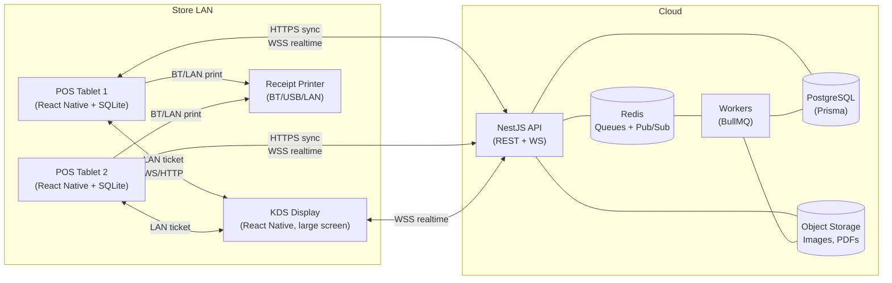
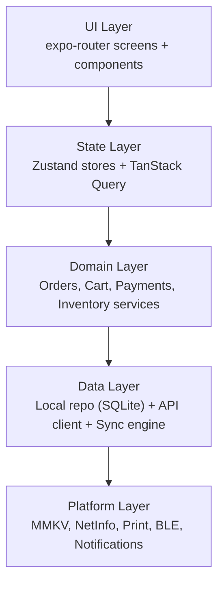
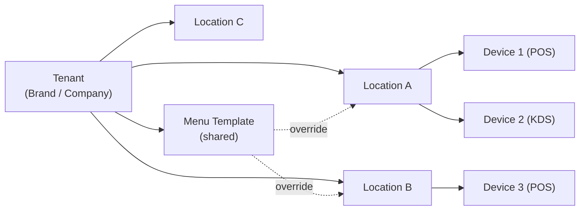

# 01 — Product Architecture

## 1.1 System overview

CPOS is composed of five runtime planes:

1. **POS device** (Android tablet / iPad / phone) — React Native app, the source of truth during a service window.
2. **Local LAN services** (optional) — KDS app, receipt printer, secondary POS devices. Discoverable via mDNS/Bonjour. Communicate over HTTP/WebSocket on the local Wi-Fi.
3. **Cloud API** — NestJS REST + WebSocket gateway, multi-tenant, deployed behind a load balancer.
4. **Cloud data plane** — PostgreSQL (primary store), Redis (queues, cache, pub/sub), object storage (S3-compatible) for product images and receipt PDFs.
5. **Async workers** — BullMQ workers for sync conflict resolution, report aggregation, image processing, low-stock alerts, webhook dispatch.



## 1.2 Mobile app architecture

The React Native app is layered. Each layer has one job and depends only on the layers below it.



Concrete responsibilities:

- **UI**: screens under `src/app/**` using `expo-router`, composed from the design system in `src/components/ui/*`.
- **State**: ephemeral UI state in Zustand (`cartStore`, `sessionStore`, `syncStore`). Server-mirrored state in TanStack Query, with the **local DB** as the cache backend (not the network).
- **Domain**: pure-TypeScript services (`createOrder`, `tenderPayment`, `applyDiscount`, `adjustInventory`). No React, no IO — easy to unit-test.
- **Data**: `LocalRepo` (SQLite via `expo-sqlite`), `ApiClient` (typed fetch wrapper with auth + retry), `SyncEngine` (push/pull/queue/conflict).
- **Platform**: `expo-secure-store`, MMKV (`react-native-mmkv`), `@react-native-community/netinfo`, `react-native-ble-plx` for Bluetooth printers, `expo-print` for AirPrint/IPP.

### Read/write rules

- **Writes go local first**, always. Domain services write through `LocalRepo` to SQLite inside a transaction. The same transaction enqueues a `sync_outbox` row.
- **Reads come from local**, always. TanStack Query reads from `LocalRepo`; the network refreshes the local DB, never the screen directly.
- The UI never knows whether it is online or offline except via a single `useSyncStatus()` hook.

## 1.3 Backend architecture

NestJS modules map 1:1 to bounded contexts:

```
api/
  src/
    modules/
      auth/            # JWT + refresh + PIN + device
      tenants/         # tenant + location + device registry
      menu/            # category, product, variant, addon, tax
      orders/          # order lifecycle, holds, splits
      payments/        # immutable payment ledger
      tables/          # floor plan, table state
      kitchen/         # KDS push, item-level status
      inventory/       # event-sourced stock ledger
      customers/       # loyalty, profiles
      reports/         # aggregations (read models)
      sync/            # pull/push, conflict resolver
      audit/           # immutable audit log
      webhooks/        # outbound integrations
    common/            # guards, interceptors, pipes, decorators
    infra/             # prisma, redis, s3, mailer
    workers/           # bullmq processors
```

### Key cross-cutting concerns

- **Tenant isolation**: a global `TenantGuard` extracts `tenantId` from JWT and attaches it to the request. A Prisma middleware injects `tenantId` into every query and rejects cross-tenant reads.
- **Idempotency**: every mutating endpoint accepts an `Idempotency-Key` header. The key + tenant + endpoint is stored in Redis for 24h and replays return the original response.
- **WebSockets**: namespaced per tenant+location. Events: `order.created`, `order.updated`, `kds.item.status`, `table.status`, `inventory.low`.
- **Read models**: reports are pre-aggregated by workers into materialized tables (`daily_sales`, `top_items`) — never compute reports from `orders` at request time.

## 1.4 Kitchen Display System (KDS)

KDS is the same React Native app in a different mode (`kdsMode=true` on device registration). It:

- Subscribes to the tenant+location WS room.
- Falls back to LAN: each POS broadcasts `kds.ticket` over the local network when an order is sent to kitchen. KDS de-dupes by `order.localId`.
- Stores tickets in its own local SQLite so a reboot mid-service does not lose state.
- Acks item-level status back over WS, which then syncs to cloud.

## 1.5 Receipt printing

A `PrintAdapter` interface with three implementations selected at runtime:

| Adapter | Transport | Lib |
|---|---|---|
| Bluetooth thermal | ESC/POS over BLE | `react-native-ble-plx` + ESC/POS encoder |
| LAN/Wi-Fi thermal | ESC/POS over TCP:9100 | `react-native-tcp-socket` |
| AirPrint / IPP | PDF | `expo-print` |

Printing never blocks the order flow. Print jobs go into a local queue (`print_queue` table) and retry. A failed print never voids an order.

## 1.6 Multi-location SaaS



- One **Tenant** = one billing customer.
- Each **Location** has its own menu, taxes, tables, employees, devices.
- A **Menu Template** at the tenant level can be cloned/overridden per location.
- Reports roll up at location and tenant level.
- Staff are scoped per location via `EmployeeLocation` join.

## 1.7 Non-functional targets

| Concern | Target |
|---|---|
| Cold start (POS billing usable) | < 1.5s on a mid-range Android tablet |
| Add-to-cart latency | < 16ms (one frame) |
| Order persisted to disk | Before payment screen renders |
| Push sync after reconnect | First flush in < 5s |
| Memory ceiling | < 250 MB resident |
| Offline runtime | Indefinite, capped only by disk |

## 1.8 Observability

- **Mobile**: Sentry (errors + perf), structured local logs ring-buffered to MMKV, exportable as a `.zip` from settings.
- **Backend**: OpenTelemetry traces, Prometheus metrics, Loki logs. Every request carries a `traceId` returned in headers; the mobile client logs it on any 4xx/5xx.
- **Business metrics**: orders/min, sync queue depth per device, KDS lag (created→ready), payment failure rate.
