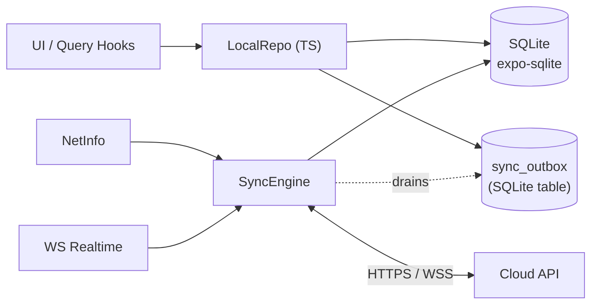
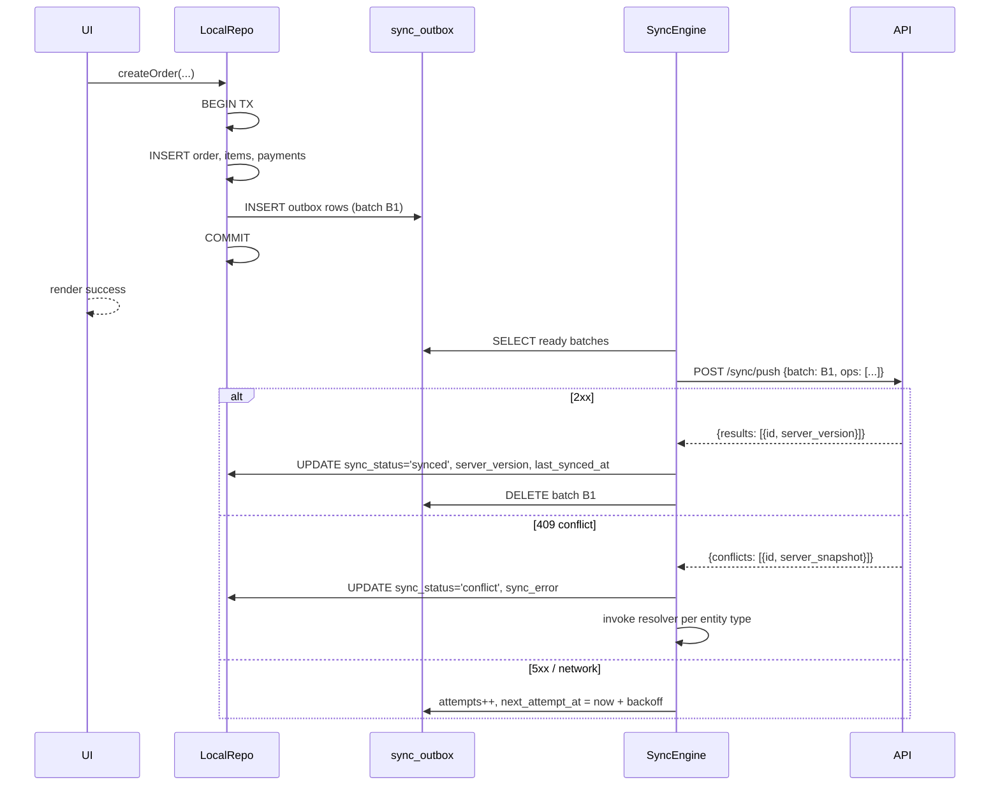
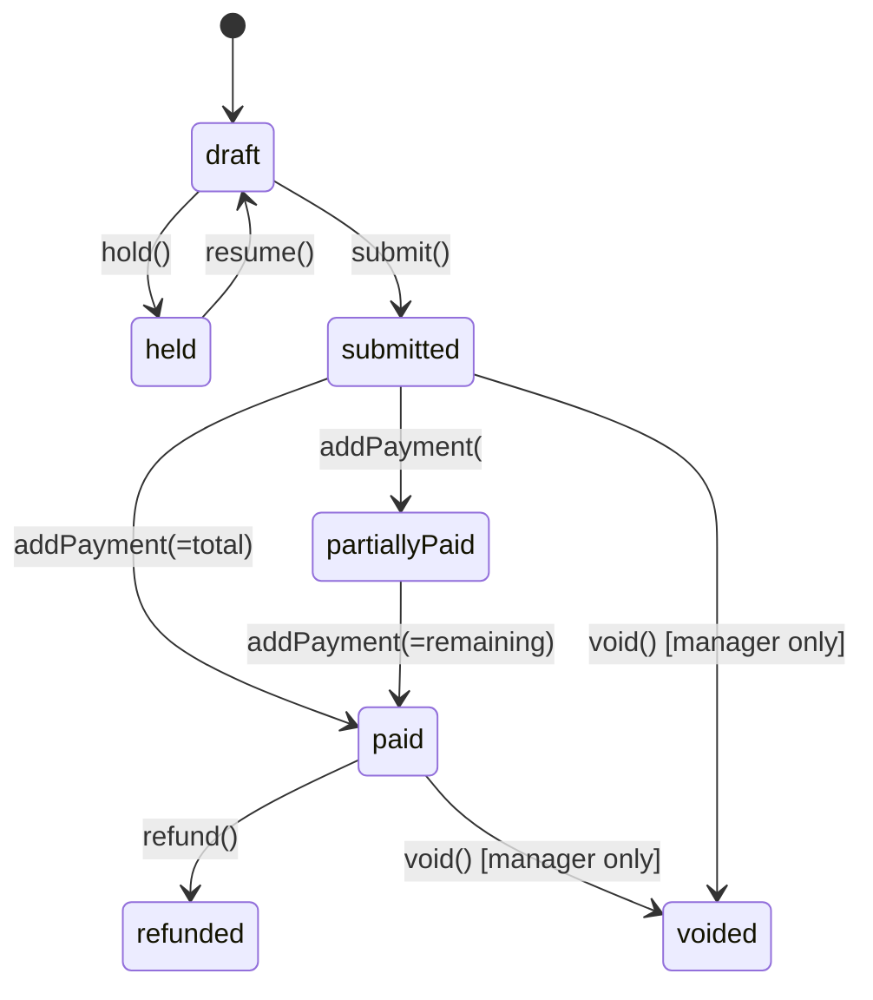

# 02 — Offline-First Architecture

The single most important property of CPOS: **the cashier can sell, take cash, and print a receipt with the Wi-Fi router unplugged.** Everything else in this document defends that property.

## 2.1 Principles

1. **Local-first writes.** Every user action is committed to local SQLite before the UI confirms it. The network is an optimization, not a dependency.
2. **The outbox is the source of truth for "what must reach the cloud."** Not the UI, not the API client retry, not memory.
3. **No destructive overwrites.** Inventory is event-sourced. Payments are append-only. Orders, once submitted, are immutable except for explicit refund/void events.
4. **Latest-wins is the exception, not the default.** Use it only for benign profile fields (customer name, email).
5. **Sync status is honest.** The UI tells the user exactly what is pending, what failed, and when the last successful sync happened.
6. **Offline is not an error state.** No red banners, no scary copy. A calm "Offline — orders will sync automatically" pill is enough.

## 2.2 Data model layers



- `LocalRepo` is the only module that writes to SQLite.
- Every write goes through a transaction that updates the domain table **and** appends to `sync_outbox`.
- `SyncEngine` drains the outbox and applies server pulls to the same tables.

## 2.3 Record-level sync metadata

Every syncable table has:

| Column | Type | Purpose |
|---|---|---|
| `id` | TEXT (uuid v7) | Primary key. Generated on device so it is stable across sync. UUID v7 is time-sortable, replacing a separate `localId`. |
| `server_id` | TEXT NULL | Set when the server confirms creation. Same value as `id` if the server accepts client-generated ids (recommended). |
| `tenant_id` | TEXT | Multi-tenant scope. |
| `location_id` | TEXT | Location scope. |
| `version` | INTEGER | Bumped on every local write. Sent as `If-Match` style on push. |
| `server_version` | INTEGER | Last version the server acknowledged. |
| `sync_status` | TEXT | `pending` \| `syncing` \| `synced` \| `failed` \| `conflict` |
| `sync_error` | TEXT NULL | Last error message for failed/conflict rows. |
| `last_synced_at` | INTEGER NULL | Epoch ms. |
| `created_at` | INTEGER | Epoch ms (device clock). |
| `updated_at` | INTEGER | Epoch ms (device clock). |
| `deleted_at` | INTEGER NULL | Tombstone for soft delete. |
| `device_id` | TEXT | Originating device for audit. |

> Using **UUID v7** generated on-device removes the dual-id (`localId`/`serverId`) problem entirely. The id is the same everywhere from the moment of creation. The server only rejects an id on hard tenant-mismatch, in which case the row is moved to a quarantine table and surfaced to the user.

## 2.4 The outbox

```sql
CREATE TABLE sync_outbox (
  outbox_id      INTEGER PRIMARY KEY AUTOINCREMENT,
  entity_type    TEXT    NOT NULL,         -- 'order', 'payment', 'inventory_event', ...
  entity_id      TEXT    NOT NULL,         -- the row's uuid v7
  operation      TEXT    NOT NULL,         -- 'create' | 'update' | 'delete'
  payload        TEXT    NOT NULL,         -- JSON snapshot at write time
  base_version   INTEGER NOT NULL,         -- version before this op
  idempotency_key TEXT   NOT NULL UNIQUE,  -- uuid v4 per op
  attempts       INTEGER NOT NULL DEFAULT 0,
  next_attempt_at INTEGER NOT NULL,
  last_error     TEXT,
  created_at     INTEGER NOT NULL
);
CREATE INDEX idx_outbox_ready ON sync_outbox(next_attempt_at, attempts);
```

Rules:

- One row per **operation**, not per entity. Creating an order with 5 items + 1 payment = 7 outbox rows wrapped in a single client-side **batch id**.
- Operations within a batch are sent atomically; the server commits the batch in one transaction.
- `idempotency_key` is sent as the `Idempotency-Key` HTTP header. The server stores key→response for 24h.

## 2.5 Push sync (device → cloud)



Backoff: exponential with jitter, base 2s, cap 5min. After 20 attempts the batch is marked `failed` and surfaced in the Sync Status screen with a manual retry button.

## 2.6 Pull sync (cloud → device)

A delta-pull endpoint based on a per-entity cursor:

```
GET /sync/pull?since={cursor}&entities=menu,customers,tables&limit=500
→ { entities: { menu: [...], customers: [...], tables: [...] }, cursor: "...", hasMore: true }
```

- The cursor is an opaque server-issued string (internally a `(tenant_id, location_id, updated_at, id)` tuple).
- Pull is **always idempotent**: applying the same delta twice is a no-op.
- The device stores the cursor per entity in `sync_cursors` so a pull crash resumes cleanly.
- Pull frequency:
  - On app foreground: pull all entities.
  - While foregrounded: pull menu + tables + customers every 60s, or on WS hint.
  - Realtime WS events (`menu.updated`, `customer.updated`) trigger an immediate targeted pull.

### Applying a pulled row

```
if local.deleted_at is set → ignore pull (local delete wins until pushed)
else if pulled.version > local.server_version → apply (overwrite local with pulled)
else if pulled.version == local.server_version → no-op
else if local.sync_status == 'pending' → conflict (call resolver)
else → no-op (local is ahead, push will reconcile)
```

## 2.7 Conflict resolution rules per entity

| Entity | Strategy | Rationale |
|---|---|---|
| **Order** (header) | Local-create wins; server cannot mutate a synced order header except via explicit refund/void events. | Orders are commitments to the customer. |
| **OrderItem** | Immutable once parent order is `submitted`. Pre-submit edits are local-only. | Same reason. |
| **Payment** | Append-only. No update, no delete. Refunds are new negative payments. | Money is a ledger. |
| **InventoryEvent** | Append-only event log. The "stock level" is a projection, never a stored mutable field. | Avoids destructive overwrites. |
| **Product / Category / Variant** | Server wins on `version > server_version`, **but** if any active (non-submitted) order references the product, the new version is staged into `menu_pending` and applied when the order closes. | Menu cannot change under a live order. |
| **Customer** | Latest-update-wins per field, with field-level `updated_at` for `name`, `email`, `phone`. | Benign profile data. |
| **LoyaltyTransaction** | Append-only. | Same as payments. |
| **Table** | Server wins for floor-plan geometry; status (`available/occupied/...`) uses last-write-wins on `updated_at` with device id as tie-breaker. | Geometry is admin; status is operational. |
| **Employee clock-in/out** | Append-only events; the "currently clocked in" flag is a projection. | Avoids overlapping shifts. |
| **AppSettings** | Server-pushed, device cannot override. | Centralized control. |

A `ConflictResolver` registry maps entity type → strategy function. Unresolved conflicts go to a `conflicts` table with the local + server snapshots and surface in the Sync Status screen.

## 2.8 Network detection

`@react-native-community/netinfo` gives connection type but **not** reachability. We add a lightweight reachability probe:

```ts
// pseudo
const reachable = await ping('/healthz', { timeoutMs: 2500 });
```

Three states: `online`, `offline`, `degraded` (connected but API unreachable). `degraded` behaves like `offline` for sync purposes but the UI shows a different message: "Connection unstable — saving locally."

## 2.9 Background sync

| Platform | Mechanism |
|---|---|
| iOS | `expo-background-fetch` / `expo-task-manager` registered task that runs the SyncEngine for ≤30s. Apple decides frequency. |
| Android | `expo-background-fetch` + Headless JS (`expo-task-manager`) for periodic, plus Foreground Service when a sync is large and the user expects it. |
| App in foreground | A `setInterval`-driven scheduler on top of `AppState` listeners. |

> Verify against https://docs.expo.dev/versions/v56.0.0/ before implementing — background task APIs were one of the SDK 56 churn areas flagged in [AGENTS.md](../AGENTS.md).

## 2.10 Local network features

- **mDNS discovery** (`react-native-zeroconf`) for KDS, secondary POS devices, and LAN printers. Each device advertises `_cpos._tcp` with a TXT record describing its role.
- **Store-and-forward across POS devices** is **out of scope for MVP** (the simpler model is: every POS syncs through the cloud, KDS is the only LAN consumer). It is a v2 feature documented in [08-roadmap.md](08-roadmap.md).

## 2.11 Order lifecycle states



- `draft` is the only state where items can be added/removed.
- `submitted` is when the kitchen ticket fires.
- Local persistence happens on **every** state transition.

## 2.12 Crash & restart recovery

On app launch the SyncEngine runs a reconciliation pass:

1. Mark any `sync_status='syncing'` rows older than 60s back to `pending` (a sync was interrupted mid-flight; the idempotency key protects us).
2. Reset `print_queue` items in `printing` state to `queued`.
3. Replay any in-memory cart state from the `carts` table (`cart_state='active'`).
4. Foreground a single full pull to catch up.

Recovery is silent; the user sees only their previous cart.

## 2.13 Visible sync UI

A single `SyncStatusBanner` component anchored at the top of the screen reflects:

| State | Copy | Color |
|---|---|---|
| All clear, online | hidden | — |
| Offline | "Offline — orders will sync automatically" | neutral |
| Syncing | "Syncing 3 orders…" with spinner | info |
| Some pending | "5 changes waiting to sync" (tap → Sync Status screen) | info |
| Failed | "Couldn't sync 2 items — tap to review" | warning |
| Conflict | "2 items need your attention" | warning |

The dedicated **Sync Status screen** lists every outbox row with entity, last error, attempts, and a "Retry" / "Discard" / "View" action.
