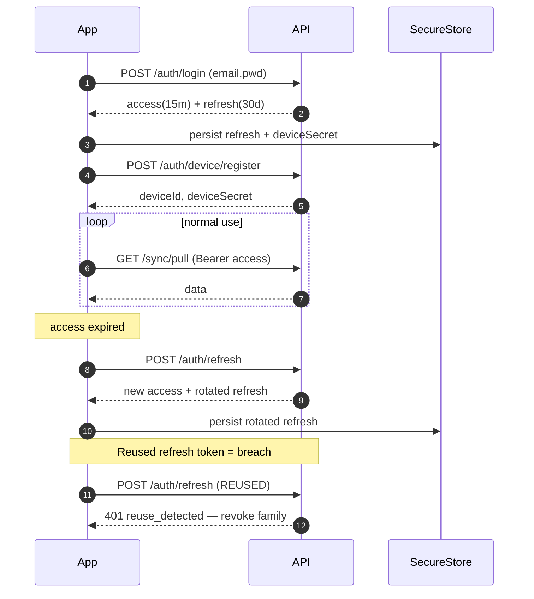

# 04 — API Design

All HTTP endpoints are JSON, versioned with a URL prefix (`/v1`), authenticated with a bearer JWT (employee access token), and tenant-scoped via the JWT claim `tid`.

## 4.1 Conventions

| Concern | Convention |
|---|---|
| Base URL | `https://api.cpos.app/v1` |
| Auth | `Authorization: Bearer <accessToken>` |
| Tenant scope | Always derived from the token (`tid` claim). Never accepted from a header. |
| Location scope | `X-Location-Id: <uuid>` header (verified against employee's allowed locations). |
| Device identity | `X-Device-Id: <uuid>` header, must match a registered, non-revoked device. |
| Idempotency | `Idempotency-Key: <uuid>` header on all mutating endpoints. Stored 24h. |
| Tracing | `X-Trace-Id` returned on every response. Echoed in client logs. |
| Time | ISO-8601 UTC with `Z`. Server is authoritative; client sends its `eventOccurredAt` for offline events. |
| Pagination | Cursor-based: `?cursor=<opaque>&limit=50`. Response: `{ items, nextCursor }`. |
| Errors | RFC 7807 problem-details: `{ type, title, status, code, detail, traceId, fields? }`. |

### Standard error codes

| HTTP | `code` | Meaning |
|---|---|---|
| 400 | `validation_failed` | Body failed schema validation; `fields` lists issues. |
| 401 | `unauthenticated` | Missing/invalid access token. |
| 401 | `token_expired` | Access token expired; client must refresh. |
| 403 | `forbidden` | RBAC denial. |
| 404 | `not_found` | Resource missing or outside tenant. |
| 409 | `conflict` | Version mismatch on push; payload includes `serverVersion` + `serverSnapshot`. |
| 409 | `duplicate` | Same id already exists with a different payload. |
| 410 | `device_revoked` | Device was revoked; client must re-register. |
| 422 | `business_rule` | Domain rule violated (e.g. refund > captured). |
| 429 | `rate_limited` | Retry after `Retry-After`. |
| 5xx | `server_error` | Generic; client should retry with backoff. |

## 4.2 Auth

```
POST /v1/auth/login
  body: { email, password }
  200: { accessToken, refreshToken, employee: {...}, tenant: {...}, locations: [...] }

POST /v1/auth/refresh
  body: { refreshToken }
  200: { accessToken, refreshToken }

POST /v1/auth/logout
  body: { refreshToken }     // server-side revoke
  204

POST /v1/auth/device/register
  body: { name, platform, osVersion, appVersion, pushToken?, locationId }
  200: { deviceId, deviceSecret }   // deviceSecret stored in expo-secure-store

POST /v1/auth/pin
  headers: X-Device-Id
  body: { pin, employeeId }         // employeeId from a chooser; pin verified server-side
  200: { accessToken, refreshToken, employee }
```

PIN login also works **offline**: the device verifies the PIN against the cached `pin_hash` (argon2id) for an employee and mints a short-lived offline session token bound to the device. The next online sync uploads a `pin_login` audit event.

## 4.3 Sync API contract

The sync API is small on purpose: two endpoints carry 90% of traffic.

### Pull

```
GET /v1/sync/pull
  headers: X-Device-Id, X-Location-Id
  query:   entities=menu,customers,tables,inventory,employees,settings
           since=<cursor>?   (per-entity cursors are also accepted: sinceMenu=, sinceCustomers=)
           limit=500
  200:
    {
      "entities": {
        "menu": {
          "categories":  [ { ... }, ... ],
          "products":    [ { ... }, ... ],
          "variants":    [ ... ],
          "addOnGroups": [ ... ],
          "addOns":      [ ... ],
          "taxes":       [ ... ],
          "productAddOns": [ ... ],
          "productTaxes":  [ ... ]
        },
        "customers": [ ... ],
        "tables":    [ ... ],
        "inventory": { "items": [...], "events": [...] },
        "employees": [ ... ],
        "settings":  { ... }
      },
      "cursors": { "menu": "...", "customers": "...", ... },
      "hasMore": false,
      "serverTime": "2026-06-25T12:00:00.000Z"
    }
```

Notes:

- Rows carry full sync metadata (`version`, `updatedAt`, `deletedAt`).
- Deleted rows are emitted as tombstones (`{ id, deletedAt }`) so the device can mirror.
- `serverTime` lets the client estimate clock skew for analytics; it is not used for ordering.

### Push

```
POST /v1/sync/push
  headers: X-Device-Id, X-Location-Id, Idempotency-Key
  body:
    {
      "batchId": "<uuid>",
      "operations": [
        {
          "opId":       "<uuid>",
          "entityType": "order",
          "entityId":   "<uuid v7>",
          "operation":  "create",
          "baseVersion": 0,
          "occurredAt": "2026-06-25T12:00:00.000Z",
          "payload":    { ... full snapshot ... }
        },
        {
          "opId":       "<uuid>",
          "entityType": "payment",
          "entityId":   "<uuid>",
          "operation":  "create",
          "baseVersion": 0,
          "occurredAt": "2026-06-25T12:00:30.000Z",
          "payload":    { ... }
        }
      ]
    }
  200:
    {
      "batchId": "<uuid>",
      "results": [
        { "opId": "...", "status": "applied", "entityId": "...", "serverVersion": 1 },
        { "opId": "...", "status": "applied", "entityId": "...", "serverVersion": 1 }
      ]
    }
  207 Multi-Status (partial):
    {
      "batchId": "<uuid>",
      "results": [
        { "opId": "...", "status": "applied",  ... },
        { "opId": "...", "status": "conflict", "entityId": "...", "serverVersion": 3,
          "serverSnapshot": { ... }, "reason": "version_mismatch" },
        { "opId": "...", "status": "rejected", "code": "business_rule",
          "detail": "Refund exceeds captured amount." }
      ]
    }
```

Push is **atomic per entity, not per batch**. A batch may partially apply; the client must handle each result. The whole batch is replay-safe because of `Idempotency-Key` (same key returns the same result) and `opId` (each op is itself idempotent).

### Push ordering rules

The server enforces a topological order regardless of array order:

1. `category` → `product` → `variant` / `addOn` / `tax` / `productAddOn` / `productTax`
2. `customer`
3. `table` (status)
4. `order` (header) → `orderItem` → `orderDiscount` → `payment`
5. `inventoryEvent`
6. `shift`

If a referenced entity is missing on the server (e.g. an offline-created customer was deleted server-side mid-flight), the dependent op is `rejected` with `code=missing_dependency`.

## 4.4 Domain endpoints

Most workflows go through `/sync/push` to keep one code path. The endpoints below are admin-side or specialized read endpoints.

### Menu (admin)

```
GET    /v1/menu/categories
POST   /v1/menu/categories
PATCH  /v1/menu/categories/:id
DELETE /v1/menu/categories/:id

GET    /v1/menu/products?categoryId=&q=&cursor=
POST   /v1/menu/products
PATCH  /v1/menu/products/:id
DELETE /v1/menu/products/:id

POST   /v1/menu/products/:id/image          # multipart upload → S3 presigned URL
GET    /v1/menu/templates                   # tenant-level
POST   /v1/menu/templates/:id/clone-to-location/:locationId
```

### Orders

```
GET    /v1/orders?status=&from=&to=&cursor=
GET    /v1/orders/:id
POST   /v1/orders                  # not used by mobile in MVP; mobile uses sync/push
POST   /v1/orders/:id/hold
POST   /v1/orders/:id/resume
POST   /v1/orders/:id/submit
POST   /v1/orders/:id/void         # requires MANAGER+; idempotent
POST   /v1/orders/:id/refund       # creates negative payment + inventory reversals
POST   /v1/orders/:id/split        # body: { groups: [[itemId,...], [itemId,...]] }
```

### Payments

```
GET    /v1/orders/:id/payments
POST   /v1/orders/:id/payments     # body: { method, amount, reference?, tendered? }
POST   /v1/payments/:id/refund     # creates negative payment, immutable original
```

### Tables

```
GET    /v1/tables                  # full floor plan
PUT    /v1/tables                  # bulk replace (admin only)
PATCH  /v1/tables/:id              # status, merge, geometry
POST   /v1/tables/:id/move-order   # body: { orderId, toTableId }
POST   /v1/tables/merge            # body: { tableIds: [a,b,c] }
```

### Kitchen / KDS

```
GET    /v1/kitchen/tickets?status=
PATCH  /v1/kitchen/tickets/:orderItemId/status   # body: { status: 'PREPARING'|'READY'|'SERVED' }
POST   /v1/kitchen/orders/:id/ready
POST   /v1/kitchen/orders/:id/served
```

WS events (kitchen room): `kds.ticket.created`, `kds.item.status`, `kds.order.ready`.

### Inventory

```
GET    /v1/inventory/items?lowStock=true&cursor=
POST   /v1/inventory/items
PATCH  /v1/inventory/items/:id
POST   /v1/inventory/items/:id/events
  body: { type, quantity, reason?, occurredAt }
GET    /v1/inventory/items/:id/events?from=&to=&cursor=
```

### Customers

```
GET    /v1/customers?q=&cursor=
POST   /v1/customers
PATCH  /v1/customers/:id
GET    /v1/customers/:id/orders
POST   /v1/customers/:id/loyalty
  body: { delta, reason, orderId? }
```

### Reports (read models)

```
GET /v1/reports/sales?from=&to=&groupBy=day|hour|location
GET /v1/reports/top-items?from=&to=&limit=20
GET /v1/reports/payments?from=&to=
GET /v1/reports/staff?from=&to=
GET /v1/reports/inventory?from=&to=
GET /v1/reports/tax?from=&to=
```

Reports are computed by workers, stored in materialized tables, and refreshed on a 5-minute cron + on-demand triggers. Mobile shows a "Last updated: 10:42 AM" stamp.

## 4.5 WebSocket gateway

```
WSS /v1/realtime
  query: ?token=<accessToken>&locationId=<uuid>
  rooms: tenant:{tid}, location:{lid}, device:{did}
```

Server-to-client events:

| Event | Payload | Audience |
|---|---|---|
| `menu.updated` | `{ entities: ['products'], cursor }` | location |
| `order.updated` | `{ orderId, version }` | location |
| `kds.ticket.created` | `{ orderId, items, table?, channel }` | KDS devices |
| `kds.item.status` | `{ orderItemId, status }` | KDS + opening POS |
| `table.status` | `{ tableId, status, version }` | location |
| `inventory.low` | `{ itemId, currentStock, threshold }` | managers |
| `sync.hint` | `{ entities: ['customers'] }` | device |

Client-to-server events are limited to `ack`, `heartbeat`, and `subscribe.kitchen`.

## 4.6 Idempotency strategy

- `Idempotency-Key` is **required** on all `POST`/`PATCH`/`DELETE` and `/sync/push`.
- The server stores `(tenantId, endpoint, key) → response` in PostgreSQL (`IdempotencyKey` table) for 24h.
- Replays return the original response with header `Idempotency-Replayed: true`.
- For `/sync/push`, the key covers the whole batch; individual `opId` values are also idempotent inside the batch so a server-side partial failure followed by a client retry is safe.

## 4.7 Auth flow (sequence)



Refresh tokens are rotated with **reuse detection**: if an old refresh token is presented after rotation, all tokens in the family are revoked and the device is forced to log in again.

## 4.8 Rate limiting

- 60 req/min per device for read endpoints.
- 10 req/min per device for `/auth/*`.
- `/sync/push` is rate-limited by **operation count**, not request count: 1,000 ops/min per device. A POS device rarely exceeds 20 ops/min in normal use.

## 4.9 Example: end-to-end order push

A cashier creates an order with 2 items and takes cash payment, all offline. When the network returns:

```http
POST /v1/sync/push HTTP/1.1
Authorization: Bearer eyJ...
X-Device-Id: 0193f1a0-2c4d-7000-a000-000000000001
X-Location-Id: 0193f1a0-2c4d-7000-a000-000000000002
Idempotency-Key: 0193f300-aaaa-7000-a000-000000000010
Content-Type: application/json

{
  "batchId": "0193f300-aaaa-7000-a000-000000000010",
  "operations": [
    {
      "opId": "...-001",
      "entityType": "order",
      "entityId": "0193f200-bbbb-7000-a000-000000000123",
      "operation": "create",
      "baseVersion": 0,
      "occurredAt": "2026-06-25T11:58:14.221Z",
      "payload": {
        "channel": "TAKEAWAY",
        "openedById": "0193f0...emp1",
        "subtotal": 9.50, "taxTotal": 0.76, "grandTotal": 10.26,
        "notes": null, "kitchenNotes": "extra hot"
      }
    },
    { "opId":"...-002","entityType":"orderItem","entityId":"...item1","operation":"create","baseVersion":0,"payload":{ ... } },
    { "opId":"...-003","entityType":"orderItem","entityId":"...item2","operation":"create","baseVersion":0,"payload":{ ... } },
    { "opId":"...-004","entityType":"payment","entityId":"...pay1","operation":"create","baseVersion":0,"payload":{
      "orderId":"0193f200-bbbb-7000-a000-000000000123",
      "method":"CASH","amount":10.26,"tendered":11.00,"change":0.74,
      "capturedAt":"2026-06-25T11:58:42.011Z","status":"CAPTURED"
    } }
  ]
}
```

Response:

```json
{
  "batchId": "0193f300-aaaa-7000-a000-000000000010",
  "results": [
    { "opId": "...-001", "status": "applied", "entityId": "0193f200-bbbb-7000-a000-000000000123", "serverVersion": 1 },
    { "opId": "...-002", "status": "applied", "entityId": "...item1", "serverVersion": 1 },
    { "opId": "...-003", "status": "applied", "entityId": "...item2", "serverVersion": 1 },
    { "opId": "...-004", "status": "applied", "entityId": "...pay1",  "serverVersion": 1 }
  ]
}
```
