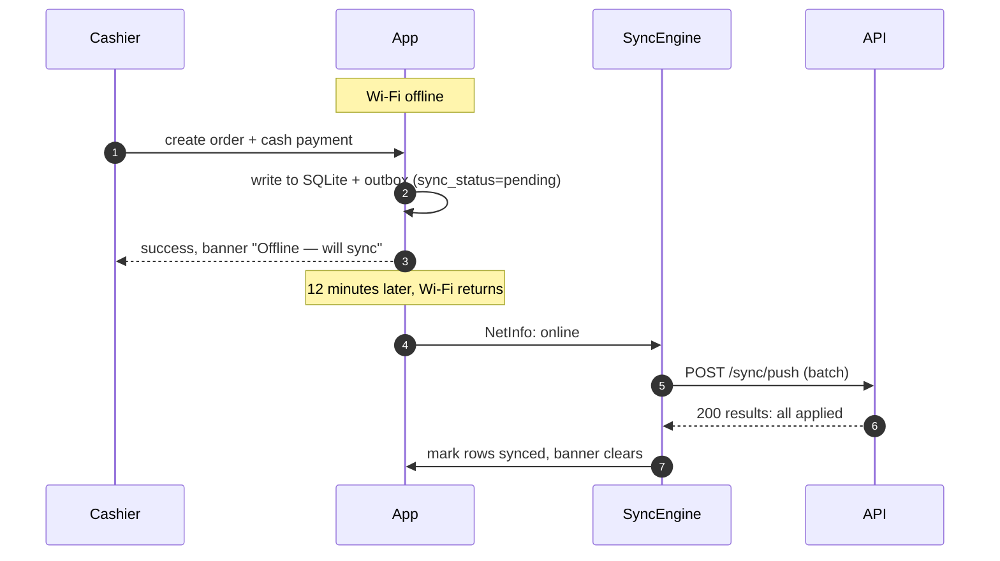
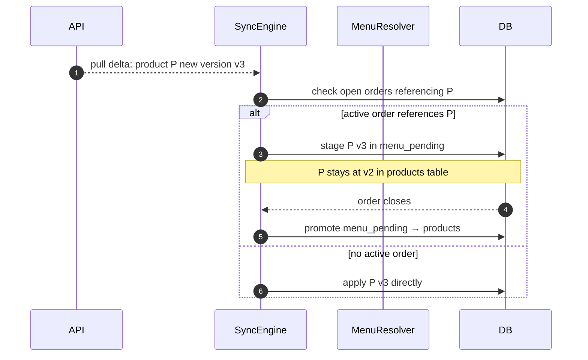
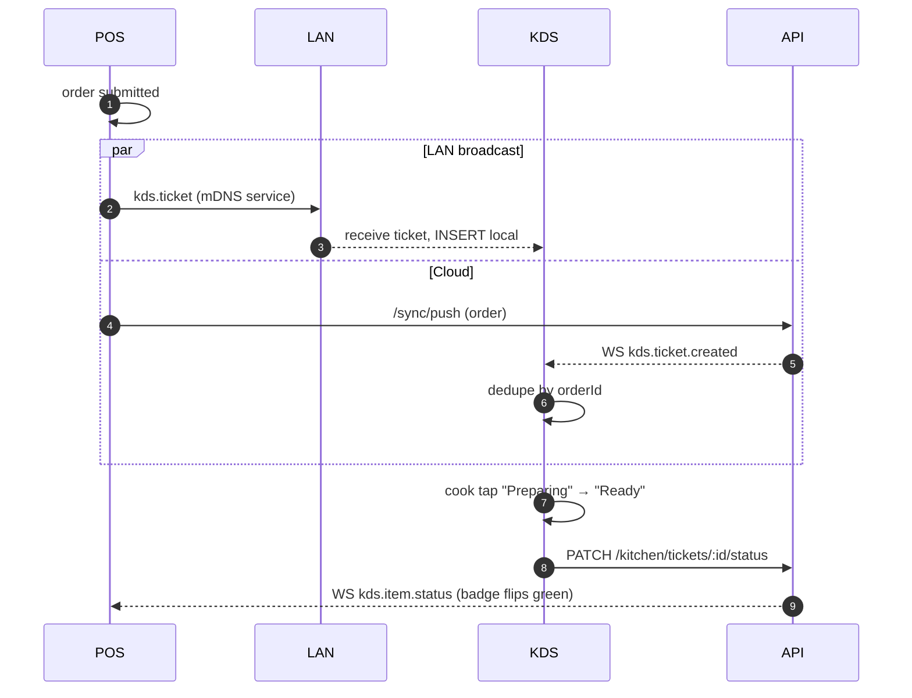
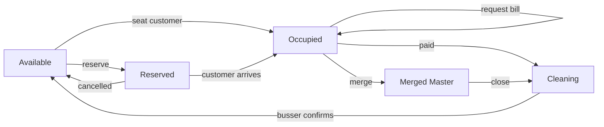
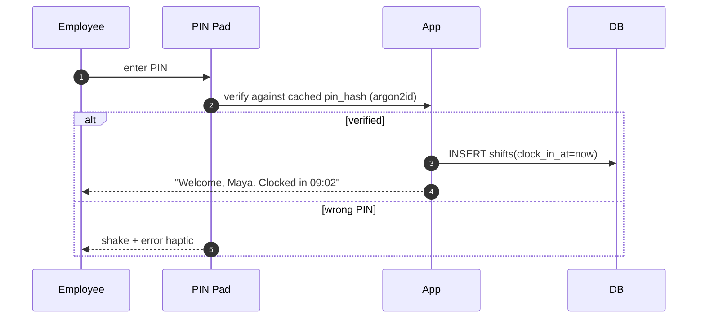

# 07 — User Flows & Wireframes

This doc captures the major user journeys as Mermaid sequence/flow diagrams and the screen layouts as ASCII wireframes. The wireframes are deliberately low-fidelity — they specify structure and hierarchy, not pixels. Hi-fi visuals follow the tokens in [06-design-system.md](06-design-system.md).

## 7.1 Cashier creates an order (happy path)

```mermaid
sequenceDiagram
  autonumber
  participant U as Cashier
  participant POS as POS Screen
  participant Cart as CartStore
  participant Repo as OrdersRepo
  participant DB as SQLite

  U->>POS: tap category
  POS-->>U: filtered product grid
  U->>POS: tap product
  POS->>Cart: addItem(productId)
  Cart-->>POS: cart updated (optimistic)
  POS->>Repo: upsertDraftOrder(snapshot)
  Repo->>DB: BEGIN; INSERT/UPDATE orders, order_items; INSERT sync_outbox; COMMIT
  U->>POS: tap "Charge"
  POS-->>U: Payment screen
```

## 7.2 Customer pays cash

```mermaid
sequenceDiagram
  autonumber
  participant U as Cashier
  participant Pay as Payment Screen
  participant Domain as tenderCash()
  participant Repo as OrdersRepo
  participant Print as PrintAdapter

  U->>Pay: tap "Cash"
  U->>Pay: enter tendered amount
  Pay->>Domain: tenderCash(orderId, tendered)
  Domain->>Repo: append payment + transition order PAID
  Repo->>Repo: write payments row + outbox; update order.status
  Domain-->>Pay: { change, receipt }
  Pay-->>U: "Change due: $0.74"
  U->>Pay: tap "Print receipt"
  Pay->>Print: enqueue receipt
  Print-->>U: prints (or queued)
```

## 7.3 Offline order creation + later sync



## 7.4 Offline → online conflict (menu changed mid-shift)



## 7.5 Kitchen order flow



## 7.6 Table management



## 7.7 Inventory adjustment (event-sourced)

```mermaid
sequenceDiagram
  autonumber
  participant Mgr as Manager
  participant UI
  participant Domain as recordEvent()
  participant DB
  Mgr->>UI: "Receive stock: 5kg coffee beans"
  UI->>Domain: type=RECEIVED, qty=+5000g, reason="invoice 123"
  Domain->>DB: INSERT inventory_events; UPDATE inventory_items.current_stock += 5000
  DB-->>UI: ok
  UI-->>Mgr: "Current stock: 5.0 kg"
```

Stock level is recomputed from the event log on first load and kept in `current_stock` as a projection. A worker recomputes nightly to detect drift.

## 7.8 Employee clock-in / clock-out



## 7.9 Refund

```mermaid
sequenceDiagram
  autonumber
  participant Mgr as Manager
  participant App
  participant Domain as refundOrder()
  participant DB
  Mgr->>App: open order → "Refund"
  App->>App: prompt manager PIN
  Mgr->>App: PIN ok
  App->>Domain: refundOrder(orderId, items, reason)
  Domain->>DB: INSERT negative payment; INSERT inventory reversals (RECEIVED events); set order.status=REFUNDED
  Domain-->>App: receipt preview
```

## 7.10 Split bill

Two modes:

- **By item**: assign each item to a group; each group becomes a sub-tab with its own payment.
- **Evenly**: divide grand total by N; each tender records a partial payment until paid in full.

The original order is the canonical record; sub-tabs are virtual at print time.

## 7.11 Wireframes

ASCII used for portability; each block stands for a section of the screen.

### 7.11.1 Login

```
┌─────────────────────────────────────────┐
│                                         │
│              ▢ CPOS logo                │
│                                         │
│           Welcome back                  │
│                                         │
│   ┌─────────────────────────────────┐   │
│   │ Email                           │   │
│   ├─────────────────────────────────┤   │
│   │ Password                        │   │
│   └─────────────────────────────────┘   │
│                                         │
│   [   Sign in   ]                       │
│                                         │
│   Use staff PIN instead →               │
│                                         │
└─────────────────────────────────────────┘
```

### 7.11.2 Store / location selection (post-login)

```
┌────────────────────────────────────────────┐
│ Hi, Priya                                  │
│ Choose a location                          │
│ ┌──────────────┐ ┌──────────────┐          │
│ │ Downtown     │ │ Airport      │          │
│ │ • 3 staff    │ │ • 1 staff    │          │
│ └──────────────┘ └──────────────┘          │
│ ┌──────────────┐                           │
│ │ Food truck   │                           │
│ └──────────────┘                           │
└────────────────────────────────────────────┘
```

### 7.11.3 POS billing — tablet landscape

```
┌─ Header ───────────────────────────────────────────────────────────────────┐
│ ☰  CPOS  Downtown ▾    [Search products]            🟢 Online   👤 Priya  │
├──────────────┬───────────────────────────────────────────┬─────────────────┤
│ Categories   │ Products                                  │ Cart (3)        │
│              │                                           │ ───────────────│
│ ◉ All        │ ┌────┐ ┌────┐ ┌────┐ ┌────┐ ┌────┐        │ Latte    × 1   │
│ ○ Coffee     │ │img │ │img │ │img │ │img │ │img │        │  $4.50         │
│ ○ Tea        │ │$4.5│ │$3.5│ │$5.0│ │$2.5│ │$4.0│        │ ───────────────│
│ ○ Bakery     │ └────┘ └────┘ └────┘ └────┘ └────┘        │ Croissant× 2   │
│ ○ Cold       │ ┌────┐ ┌────┐ ┌────┐ ┌────┐ ┌────┐        │  $6.00         │
│ ○ Specials   │ │... │ │... │ │... │ │... │ │... │        │ ───────────────│
│              │ └────┘ └────┘ └────┘ └────┘ └────┘        │ Subtotal $10.50│
│              │                                           │ Tax       $0.84│
│              │                                           │ Total    $11.34│
│              │                                           │ [Hold] [Charge]│
└──────────────┴───────────────────────────────────────────┴─────────────────┘
```

### 7.11.4 POS billing — phone

```
┌────────────────────────────┐
│ ☰  Downtown   🟢   👤      │
├────────────────────────────┤
│ [ All | Coffee | Tea | … ] │
├────────────────────────────┤
│ ┌──────┐ ┌──────┐ ┌──────┐ │
│ │img   │ │img   │ │img   │ │
│ │$4.50 │ │$3.50 │ │$5.00 │ │
│ └──────┘ └──────┘ └──────┘ │
│ ┌──────┐ ┌──────┐ ┌──────┐ │
│ │ ...  │ │ ...  │ │ ...  │ │
│ └──────┘ └──────┘ └──────┘ │
├────────────────────────────┤
│ 🛒 3 items · $11.34 →  Cart│  ← floating bottom bar
└────────────────────────────┘
```

Cart on phone slides up as a bottom sheet.

### 7.11.5 Modifier sheet

```
┌────────────────────────────┐
│ Latte                      │
│ ───────────────────────────│
│ Size                       │
│ ( ) Small        + $0.00   │
│ (•) Medium       + $0.50   │
│ ( ) Large        + $1.00   │
│ ───────────────────────────│
│ Milk                       │
│ [ ] Whole                  │
│ [•] Oat          + $0.75   │
│ [ ] Almond       + $0.75   │
│ ───────────────────────────│
│ Notes [ extra hot       ]  │
│                            │
│ [ Add to order  $5.25 ]    │
└────────────────────────────┘
```

### 7.11.6 Payment

```
┌─────────────────────────────────────────────┐
│ ← Order #042                $11.34          │
├─────────────────────────────────────────────┤
│ ┌──────────┐ ┌──────────┐ ┌──────────┐      │
│ │  Cash    │ │  Card    │ │  UPI     │      │
│ └──────────┘ └──────────┘ └──────────┘      │
│                                             │
│ Tendered      $ [   20.00      ]            │
│ [5] [10] [20] [Exact]                       │
│                                             │
│ ┌─ NumberPad ─┐                             │
│ │ 1 2 3       │                             │
│ │ 4 5 6       │                             │
│ │ 7 8 9       │                             │
│ │ . 0 ⌫       │                             │
│ └─────────────┘                             │
│                                             │
│ Change due  $ 8.66                          │
│ [    Complete & print receipt    ]          │
└─────────────────────────────────────────────┘
```

### 7.11.7 Receipt

```
┌─────────────────────────────────────────────┐
│              CAFÉ DOWNTOWN                  │
│           123 Market St · CPOS              │
│ ─────────────────────────────────────────── │
│ Order #042       2026-06-25 11:58           │
│ Cashier: Priya                              │
│ ─────────────────────────────────────────── │
│ 1× Latte (M, Oat)              $ 5.25       │
│ 2× Croissant                   $ 6.00       │
│ ─────────────────────────────────────────── │
│ Subtotal                       $11.25       │
│ Tax  (8%)                      $ 0.09       │
│ Total                          $11.34       │
│ Cash                           $20.00       │
│ Change                         $ 8.66       │
│ ─────────────────────────────────────────── │
│        Thanks! See you soon ☕              │
│  [ Print again ]  [ Email ]  [ Done ]       │
└─────────────────────────────────────────────┘
```

### 7.11.8 Table management

```
┌─────────────────────────────────────────────┐
│ Floor plan          [+ Add table] [Edit]    │
├─────────────────────────────────────────────┤
│   ┌──┐ ┌──┐                ┌────────┐       │
│   │T1│ │T2│                │  Bar   │       │
│   │🟢 │ │🟡 │                │ 🟢🟢🟡 │       │
│   └──┘ └──┘                └────────┘       │
│   ┌──┐ ┌──┐ ┌──┐                            │
│   │T3│ │T4│ │T5│                            │
│   │🔴 │ │🟢 │ │🟣 │                            │
│   └──┘ └──┘ └──┘                            │
│                                             │
│ Legend: 🟢 Available 🟡 Occupied            │
│         🔴 Cleaning  🟣 Reserved            │
└─────────────────────────────────────────────┘
```

### 7.11.9 KDS

```
┌─ NEW ─────────┬─ PREPARING ───┬─ READY ───────┬─ SERVED ─────────┐
│ #042  02:14   │ #041  04:31   │ #039  06:02   │ #038             │
│ • Latte M Oat │ • Iced Mocha  │ • Cappuccino  │ • Espresso       │
│ • 2× Croiss   │ • Bagel       │ • Pain au Ch. │ • Latte L Almond │
│ note: hot     │ ───────────── │ ───────────── │ ─────────────── │
│ [Start]       │ [Ready]       │ [Served]      │                  │
│ ───────────── │               │               │                  │
│ #043  00:08   │               │               │                  │
│ • Tea         │               │               │                  │
│ [Start]       │               │               │                  │
└───────────────┴───────────────┴───────────────┴──────────────────┘
```

Cards turn amber after 5 min in column, red after 10 min.

### 7.11.10 Inventory

```
┌──────────────────────────────────────────────────┐
│ Inventory         [Receive] [Adjust] [+ Item]    │
├──────────────────────────────────────────────────┤
│ Q [ Search ]   Filter: [All ▾] [Low stock]       │
├──────────────────────────────────────────────────┤
│ • Coffee beans            5.0 kg     ⚠ Low       │
│ • Oat milk               18 L                    │
│ • Almond milk            12 L                    │
│ • Croissants             24 ea                   │
│ • Bagels                  6 ea     ⚠ Low         │
└──────────────────────────────────────────────────┘
```

Tapping a row reveals the event log + adjust action sheet.

### 7.11.11 Menu management

```
┌──────────────────────────────────────────────┐
│ Menu       Tab: Categories | Products | Mods │
├──────────────────────────────────────────────┤
│ Categories             [+ New]               │
│ ≡ Coffee       9 items     ●●●●○○   ✏ 🗑     │
│ ≡ Tea          5 items                       │
│ ≡ Bakery       8 items                       │
│ ≡ Cold drinks  6 items                       │
└──────────────────────────────────────────────┘
```

Drag handle (`≡`) reorders categories; reorders are sync'd as `update` ops.

### 7.11.12 Reports dashboard

```
┌─────────────────────────────────────────────────────────┐
│ Reports        Today ▾    Last updated 10:42 AM  ↻      │
├─────────────────────────────────────────────────────────┤
│ ┌──────────┐ ┌──────────┐ ┌──────────┐ ┌──────────┐     │
│ │  Sales   │ │ Orders   │ │ Avg tkt  │ │ Refunds  │     │
│ │  $1,243  │ │   87     │ │ $14.29   │ │  $24.00  │     │
│ └──────────┘ └──────────┘ └──────────┘ └──────────┘     │
│ ┌─ Sales by hour ───────────────────────────────────┐   │
│ │    ▁▂▃▅█▆▅▃▂▁ ...                                  │   │
│ └────────────────────────────────────────────────────┘   │
│ Top items                  Payment mix                  │
│ 1 Latte         32         Cash    44 %                 │
│ 2 Croissant     21         Card    38 %                 │
│ 3 Cappuccino    18         UPI     18 %                 │
└─────────────────────────────────────────────────────────┘
```

### 7.11.13 Settings → Sync status

```
┌────────────────────────────────────────────────┐
│ Sync                                           │
├────────────────────────────────────────────────┤
│ 🟢 Last synced today at 10:42 AM               │
│ 0 pending · 0 failed · 0 conflicts             │
├────────────────────────────────────────────────┤
│ Pending (0)         Failed (0)    Conflicts (0)│
│                                                │
│ (empty)  "Everything is up to date"            │
│                                                │
│ [Force sync now]  [Export diagnostics]         │
└────────────────────────────────────────────────┘
```

When there are pending items, each row shows entity, age, retry count, and inline actions.

## 7.12 Hi-fi UI direction

The wireframes above + tokens from [06-design-system.md](06-design-system.md) produce the visual style. Key hi-fi notes:

- Product cards: soft shadow, 16-radius, image fills card with 12px padding, name truncates at 2 lines, price is the only color accent.
- Cart panel on tablet: sticky footer with total, large gradient "Charge" CTA in brand-500 → brand-600.
- Floor plan: hand-drawn-looking shapes with a calm pastel palette per status.
- Empty states: friendly line illustrations (single-color brand-300), never grayscale.
- Dark mode is **not** an inverted light mode — surface colors are tuned for kitchen and night-shift glare.
