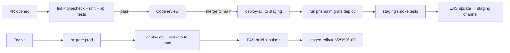

# 11 — Deployment Strategy

## 11.1 Environments

| Env | Audience | Domain | Mobile distribution |
|---|---|---|---|
| `dev` | engineering | `api.dev.cpos.app` | EAS internal channel + Expo dev client |
| `staging` | QA + pilots | `api.staging.cpos.app` | TestFlight / Internal Testing track |
| `prod` | live tenants | `api.cpos.app` | App Store / Play Store production |

Each environment has its own:

- Postgres cluster (separate database, separate KMS key).
- Redis instance.
- S3 bucket.
- Sentry project.
- EAS build profile + secrets.
- Domain + TLS certificate.

## 11.2 Backend deployment

### Containerization

- `Dockerfile` per app (`apps/api`, future `apps/admin-web`).
- Multi-stage build: `node:20-alpine` builder → distroless or `node:20-alpine` runner.
- Runs as a non-root user.
- Health endpoint: `GET /healthz` returns `200` only when DB + Redis are reachable.

### Orchestration options

Pick **one** at MVP and stick with it. Recommended progression:

1. **MVP**: a managed PaaS (Fly.io, Render, Railway) or a single ECS Fargate service. Lowest ops overhead, good enough for the first few tenants.
2. **Growth (50+ tenants or first multi-region)**: Kubernetes (EKS/GKE) with Helm charts. Adds horizontal pod autoscaling, separate worker deployments, blue/green via ArgoCD.

Either way, the **workers** (BullMQ consumers) run as a **separate service** from the API. They share the same container image but a different entrypoint (`node dist/workers/main.js`).

### Database

- PostgreSQL 15+ managed service (RDS, Cloud SQL, Neon). Multi-AZ in production.
- Connection pooling via PgBouncer in **transaction mode** (Prisma must be configured for it).
- Migrations run from CI **before** the new app version goes live, never from a running app instance.
- Backups: continuous WAL archiving + daily snapshots, 30-day retention in production. Quarterly restore drill.

### Redis

- Managed service (ElastiCache, Memorystore, Upstash). Multi-AZ.
- Used for: BullMQ queues, idempotency cache, pub/sub for WS scaling, rate-limit counters.
- Persistence enabled (AOF) — losing the idempotency cache would force clients to retry, but no data loss.

### Object storage

- S3 (or any S3-compatible) bucket per environment.
- Public read **disabled**. All product images served via short-lived signed CloudFront/Cloud-CDN URLs, regenerated at API time.
- Lifecycle: receipt PDFs auto-tier to Glacier after 90 days, deleted after the tenant's retention setting (default 7 years for tax records).

### TLS, DNS, CDN

- DNS in Route 53 / Cloudflare.
- TLS via ACM / Let's Encrypt with auto-renewal.
- Cloudflare or CloudFront in front of:
  - `api.*` for DDoS protection and WS termination.
  - `cdn.*` for product images.
- WAF rules: rate-limit `/auth/*`, block known bad IP ranges, enforce body size limits.

### Secrets & config

- Secrets in AWS Secrets Manager / Doppler / 1Password Connect.
- Application reads them at boot through a small client; never written to disk.
- Per-environment KMS keys for the field-level encryption layer described in [09-security.md](09-security.md).

### Observability

| Concern | Tool |
|---|---|
| Logs | Loki or CloudWatch Logs (structured JSON). |
| Metrics | Prometheus + Grafana (or vendor: Datadog, Grafana Cloud). |
| Traces | OpenTelemetry → Tempo / Jaeger. |
| Errors | Sentry (server + mobile, sharing release tags). |
| Uptime | Synthetic checks every 60s against `/healthz` + a deep "create-then-delete" check against staging. |

Key alerts (PagerDuty / Opsgenie):

- API 5xx rate > 1% for 5 min.
- Sync push p95 > 2s for 10 min.
- BullMQ queue depth > 1,000 for 10 min.
- DB connections > 80% pool for 5 min.
- Disk > 80%.
- WS connection rate spike > 10× baseline.

## 11.3 Mobile deployment (EAS)

### Build profiles (`eas.json`)

```jsonc
{
  "build": {
    "development": {
      "developmentClient": true,
      "distribution": "internal",
      "channel": "development"
    },
    "preview": {
      "distribution": "internal",
      "channel": "staging",
      "ios":     { "simulator": false },
      "android": { "buildType": "apk" }
    },
    "production": {
      "channel": "production",
      "autoIncrement": true,
      "ios":     { "resourceClass": "m-medium" },
      "android": { "buildType": "app-bundle" }
    }
  },
  "submit": {
    "production": {
      "ios":     { "ascAppId": "XXXXXXXXXX" },
      "android": { "serviceAccountKeyPath": "./play-key.json", "track": "production" }
    }
  }
}
```

### Release channels & OTA

- We use **EAS Update** for JS-only fixes between native builds.
- Channels: `development`, `staging`, `production`.
- Branch policy:
  - `main` → staging channel automatically on merge.
  - Tag `v*.*.*` → production channel + native build + store submission.
- **Runtime version policy**: `policy: "appVersion"`. Native binary changes require a new build; JS-only fixes ship as updates.

### Native vs JS-only

Anything touching native code (new BLE library, new SDK upgrade, app icon, Splash, permissions in `app.json`) requires a new build. The CI tag pipeline always builds and submits a fresh binary for `vX.Y.0` releases; patch releases (`vX.Y.Z`) ship as OTA.

> **Verify SDK 56 behavior** before committing to a policy. The runtime version semantics changed in recent Expo versions; check https://docs.expo.dev/versions/v56.0.0/sdk/updates/ as flagged by [AGENTS.md](../AGENTS.md).

### Store rollout

- iOS: phased release over 7 days.
- Android: staged rollout starting at 5% for 24 hours, then 25%, 50%, 100% with automated halt if Sentry crashfree drops below 99.5%.
- A "kill switch" in `app_settings` lets us force users onto a previous OTA bundle if a release is bad.

### Code signing

- iOS: Apple Distribution cert managed by EAS.
- Android: app signing managed by Play App Signing; upload key stored in EAS.
- All builds reproducible (lockfile committed, pinned SDKs).

## 11.4 Infrastructure as Code

- **Terraform** for cloud resources (Postgres, Redis, S3, IAM, DNS).
- **Helm** for Kubernetes (when applicable).
- **Renovate** for dependency PRs.
- **Atlantis** or **GitHub Environments + manual approval** for production Terraform applies.

Repo layout:

```
infra/
  terraform/
    envs/{dev,staging,prod}/
    modules/{network,database,redis,s3,iam,api,workers}/
  helm/
    cpos-api/
    cpos-workers/
  github-actions/
    deploy-api.yml
    deploy-workers.yml
    mobile-release.yml
```

## 11.5 CI/CD pipelines



### Migration safety

- Migrations are **expand-only by default**: add columns nullable, backfill with a worker, switch reads, then a follow-up migration drops the old column. Destructive migrations require a manual approval step.
- The API version is **backwards compatible** with the previous mobile binary for at least 90 days. The Sync API contract is versioned via the URL prefix (`/v1`, `/v2`); breaking changes ship under a new prefix and the old one stays available until adoption is ≥99%.

## 11.6 Disaster recovery

| Scenario | RPO | RTO | Plan |
|---|---|---|---|
| API instance crash | 0 | < 1 min | Auto-restart by orchestrator. |
| AZ outage | 0 | < 5 min | Multi-AZ DB + Redis; load balancer fails over. |
| Region outage | < 15 min | < 2 hours | Warm standby in a second region; DNS failover (manual approval). |
| DB corruption | < 5 min | < 1 hour | PITR restore from WAL. |
| Bad release | 0 | < 15 min | OTA rollback (mobile) + previous container image (server). |
| Data leak | n/a | < 24 hours | Rotate KMS keys, revoke all device tokens, force re-login. |

Quarterly drills exercise: PITR restore, region failover, OTA rollback, mobile force-update.

## 11.7 On-call

- One rotation: a Primary and a Secondary, weekly.
- Alerts route through PagerDuty / Opsgenie with severity:
  - SEV-1 (sales blocked): page immediately.
  - SEV-2 (degraded): page during business hours.
  - SEV-3: ticket only.
- Runbooks live in `docs/runbooks/` (not in this blueprint pass — written as alerts get authored).

## 11.8 Tenant onboarding

1. Owner signs up via the mobile app (or admin web in v1.1+).
2. Server provisions: tenant row, first location, owner employee, default tax, sample menu (optional, opt-in).
3. Owner is prompted to register their first device (an EAS-built dev client during pilots, or a Play/App Store build in production).
4. Owner adds employees and assigns PINs.
5. Optional CSV menu import.
6. Pilot stores get a **white-glove** onboarding: a CPOS engineer joins on-site for setup day.

## 11.9 Cost guardrails

- Per-tenant cost budget for the free tier (target ≤ $0.50/month per active location).
- Image upload size capped (8 MB, resized server-side to 800×800 + 320×320 thumb).
- Backup retention tiered: 30 days hot, 1 year warm (Glacier), then deleted.
- Idle compute scales to zero in dev/staging at night.
- Per-tenant rate limits with overage billing in v1.5+.

## 11.10 Launch readiness checklist (one-time)

- [ ] DNS records, TLS certs, HSTS, security headers verified.
- [ ] Production secrets rotated from any shared dev values.
- [ ] PITR enabled, restore drill completed, backup retention set.
- [ ] PagerDuty rotation live, runbooks written for top 5 alerts.
- [ ] App Store + Play Store listings complete, privacy labels filed.
- [ ] Sentry + analytics scrub rules verified (no PII).
- [ ] Pen-test report addressed.
- [ ] Status page (status.cpos.app) live.
- [ ] Customer support inbox + Slack channel staffed.
- [ ] Pilot cafe owner has the engineer's mobile number.
